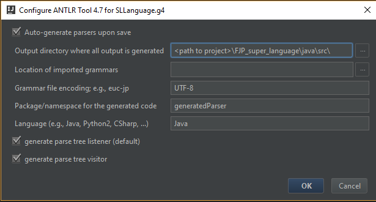

# FJP_super_language

This project is a term work for subject KIV/FJP at University of West Bohemia.

It's compiler for java/c-like language to instruction set PL/0.

This language support following elements:
integer and boolean definition,
constant definiton,
assigment,
basic arithmetic and logic operation (+, -, *, /, AND, OR, negation, brackets, <, >, ==, !=),
simple condition: if & else,
compound condition: switch,
cycles: while, for, do-while, until, repeat-until,
ternal if,
function with parameter and return value,
arrays.

To run project you need ANTLR v4 & IntelliJ v2016 and newer.
You can find useful information about antlr plugin in IntelliJ in following links:

https://github.com/antlr/antlr4/blob/master/doc/java-target.md

http://www.antlr.org/download.html

https://github.com/antlr/antlr4/blob/master/doc/getting-started.md

After installing IntelliJ and ANTLR you can import our project into IntelliJ.
There is several test files in directory testFiles. To compile these test files to PL/0 you can
run class runTests.java. More info to tests is in documentation.

## Structure of project
- Main method to our project is in folder - **java/src/Main.java**
- Executible jar is in - **java/out/artifacts/FJP_super_language_jar**
- Grammar for our language is in root directory - **SLLanguage.g4**

> .idea
- settings for intelliJ environment
> docs
- documentation and other documents for project
> java
- source and output of project
> tests
- files which are used to testing our solution

## Setting up environment
Everything should be done when you clone or download this repository and then you can open it like intellJ project. Except on setting up 
parser for ANTLR.
> to parse our grammar in intelliJ you need to follow these steps
- you need install intelliJ plugin for ANTLR - info above
- then right click on **SLLanguage.g4** file
- select **configure ANTLR..**
- and set up like in image below

> if grammar is changed, you need to run project twice or just press shortcut <kbd>Ctrl</kbd>+<kbd>Shift</kbd>+<kbd>G</kbd>
